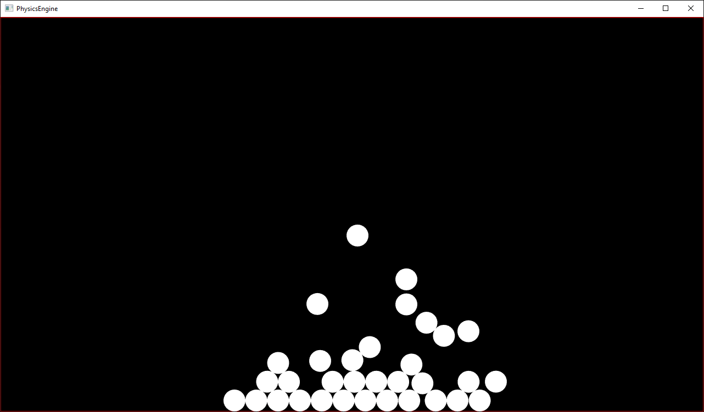

# 2D Physics Engine

This is my attempt at making a 2D physics engine inspired by [Designing a Physics Engine in 5 minutes][video] by Winterdev.

### Example

	

### Capabilities

As of now, the engine supports basic collision detection between objects of type: circle and line.

### todo

- fix the "explosion" issue when objects are inside each other
- add more object types
- add position solver
- add more properties to objects, such as: friction, restitution, etc.

[video]: https://www.youtube.com/watch?v=-_IspRG548E
